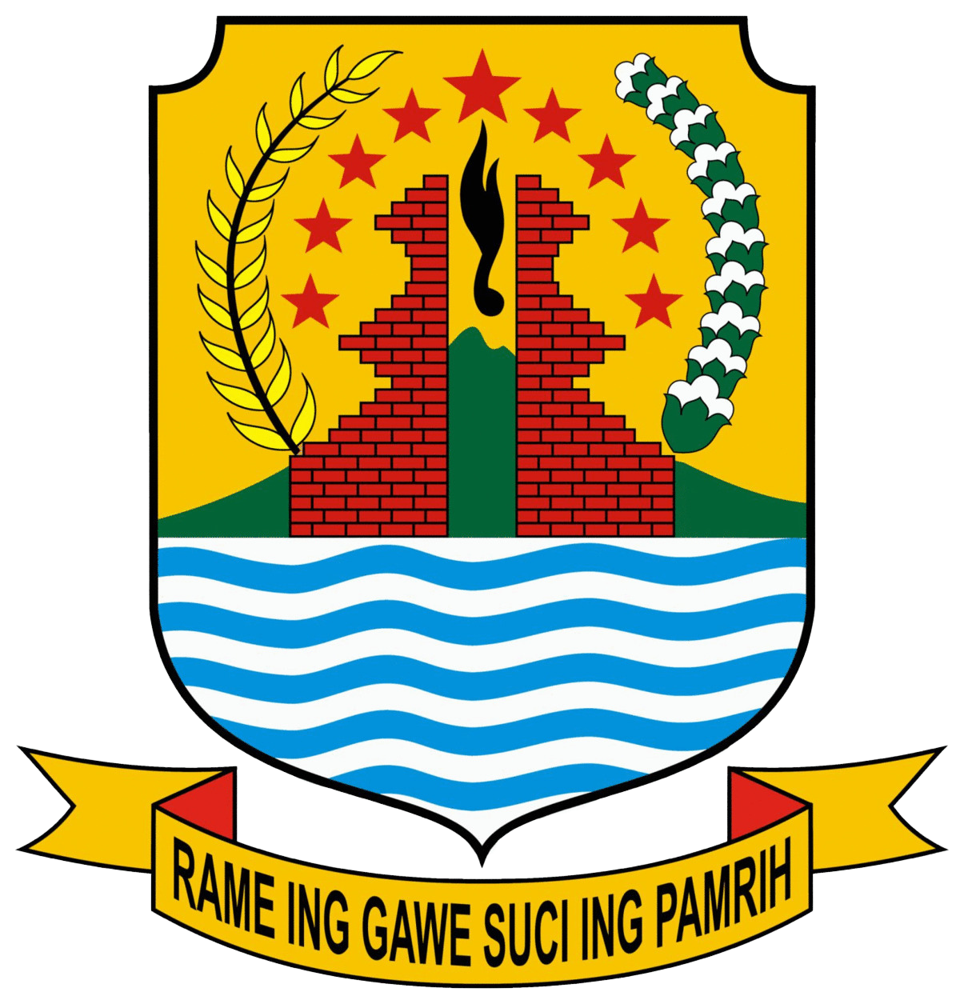

# 🌊 Portal UMKM Desa Mundu Pesisir

<p align="center">
  
</p>

<p align="center">
  <strong>Platform Katalog Digital, Profil Potensi Desa Bahari, dan Etalase Produk Unggulan UMKM Desa Mundu Pesisir, Kabupaten Cirebon.</strong>
</p>

<p align="center">
  
  
  
  
  
</p>

---

## 📌 Tentang Proyek

**UMKM Mundu Pesisir** adalah platform web modern yang dirancang untuk mempromosikan produk olahan laut lokal dan memberdayakan nelayan serta pelaku UMKM di Desa Mundu Pesisir, Kecamatan Mundu, Kabupaten Cirebon.

Desa Mundu Pesisir dikenal sebagai sentra penghasil **Siwang (Terasi Bawang)** legendaris, Kerupuk Payur gurih, serta aneka olahan hasil tangkapan laut segar dari pesisir Laut Jawa. Melalui website ini, konsumen dapat menjelajahi ragam produk unggulan, membaca profil kearifan lokal (seperti tradisi *Nadran* dan pelestarian hutan mangrove), serta memesan produk secara langsung melalui integrasi WhatsApp.

---

## ✨ Fitur Utama

### 🛍️ Pengalaman Pengguna (Etalase Publik)
- **Katalog Produk Dinamis**: Menampilkan aneka produk olahan laut lengkap dengan harga, foto kemasan, label kategori, komposisi, serta masa simpan.
- **Pencarian & Filter Interaktif**: Memudahkan pencarian produk berdasarkan nama maupun kategori olahan.
- **Halaman Detail Produk**: Tampilan komprehensif spesifikasi produk, galeri gambar, keunggulan bahan baku, dan tautan pemesanan kilat.
- **Pemesanan Direct WhatsApp**: Otomatis membuat template pesan pesanan produk menuju WhatsApp resmi UMKM.
- **Profil & Budaya Bahari**: Halaman pengenalan desa, visi kemandirian ekonomi nelayan, statistik wilayah, serta dokumentasi tradisi lokal.
- **Sistem Testimoni Pelanggan**: Tampilan ulasan pelanggan terverifikasi dengan rating bintang interaktif dan formulir kirim ulasan baru.
- **Kontak & Lokasi Terintegrasi**: Informasi alamat lengkap kantor desa, jam operasional, tautan media sosial, serta petunjuk arah peta.
- **Desain Responsif & Premium**: Tampilan mobile-first yang nyaman diakses di smartphone maupun desktop, dilengkapi animasi bernuansa pesisir laut.

### 🔐 Panel Manajemen (Admin Dashboard)
- **Autentikasi Proteksi**: Akses dashboard `/admin` dilindungi verifikasi password admin yang aman.
- **Manajemen CRUD Produk**: Tambah produk baru, edit detail produk (harga, deskripsi, spesifikasi), serta hapus produk dengan sinkronisasi langsung ke Supabase.
- **Upload Gambar Otomatis**: Integrasi pengunggahan gambar produk langsung ke bucket penyimpanan *Supabase Storage*.
- **Moderasi Testimoni**: Verifikasi, aktivasi, maupun hapus ulasan yang dikirimkan oleh pembeli.
- **Tools Diagnostik & Database**: Fitur inisialisasi skema tabel otomatis dan pengecekan koneksi database langsung dari dashboard.

---

## 🛠️ Tech Stack

| Kategori | Teknologi | Deskripsi |
| :--- | :--- | :--- |
| **Framework** | [Next.js 16 (App Router)](https://nextjs.org/) | Framework React performa tinggi dengan arsitektur modern Server & Client Components |
| **Library UI** | [React 19](https://react.dev/) | Library deklaratif untuk antarmuka pengguna berbasis komponen |
| **Bahasa** | [TypeScript](https://www.typescriptlang.org/) | Pengetikan statis untuk keandalan dan skalabilitas kode |
| **Styling** | [Tailwind CSS v4](https://tailwindcss.com/) | Framework CSS utility-first untuk desain responsif dan kustomisasi tema |
| **Ikon** | [Lucide React](https://lucide.dev/) | Koleksi ikon SVG modern dan ringan |
| **Backend & DB** | [Supabase](https://supabase.com/) | Backend-as-a-Service berbasis PostgreSQL, Autentikasi, dan Cloud Object Storage |

---

## 📂 Struktur Direktori

```plaintext
umkm-mundu-pesisir/
├── app/
│   ├── (main)/              # Route group untuk halaman publik
│   │   ├── kontak/          # Halaman kontak desa & UMKM
│   │   ├── produk/          # Halaman katalog produk & [id] detail produk
│   │   ├── profil/          # Halaman profil desa & sejarah bahari
│   │   ├── testimoni/       # Halaman testimoni & ulasan pembeli
│   │   ├── layout.tsx       # Layout publik (Navbar & Footer)
│   │   └── page.tsx         # Homepage / Landing page utama
│   ├── admin/               # Halaman panel kontrol & manajemen produk/testimoni
│   ├── globals.css          # Styling global & tema Tailwind CSS
│   ├── layout.tsx           # Root layout aplikasi & konfigurasi font
│   └── not-found.tsx        # Halaman custom 404
├── components/              # Komponen UI modular
│   ├── admin/               # Komponen seksi admin
│   ├── contact/             # Komponen halaman kontak
│   ├── cta/                 # Komponen call-to-action banner
│   ├── features/            # Komponen kartu keunggulan & ilustrasi bahari
│   ├── footer/              # Komponen footer situs
│   ├── hero/                # Komponen hero banner utama
│   ├── navbar/              # Komponen navigasi header & mobile drawer
│   ├── products/            # Komponen katalog, kartu, & detail produk
│   ├── profile/             # Komponen artikel profil desa
│   └── testimonials/        # Komponen kartu testimoni & modal ulasan
├── constants/               # Data statis fallback, konfigurasi teks, dan tipe
├── hooks/                   # Custom React hooks (useProducts, useTestimonials)
├── lib/                     # Utilitas pendukung, client Supabase, dan helper
├── public/                  # Aset gambar produk, logo desa, dan ikon
├── supabase-schema.sql      # Skema query database PostgreSQL untuk Supabase
└── package.json             # Dependensi dan skrip proyek
```

---

## 🚀 Panduan Memulai (Instalasi Lokal)

### 1. Prasyarat Sistem
Pastikan perangkat Anda telah terpasang:
- **Node.js** versi 18.18 atau lebih baru ([Unduh Node.js](https://nodejs.org/))
- **npm**, **yarn**, atau **pnpm**
- **Git**

### 2. Kloning Repository
```bash
git clone https://github.com/mundupesisir-umkm/umkm-mundu-pesisir.git
cd umkm-mundu-pesisir
```

### 3. Instalasi Dependensi
```bash
npm install
```

### 4. Konfigurasi Environment Variables
Salin file template `.env.example` menjadi `.env.local`:
```bash
cp .env.example .env.local
```

Buka file `.env.local` dan isi kredensial proyek Supabase Anda:
```env
NEXT_PUBLIC_SUPABASE_URL=https://<project-id>.supabase.co
NEXT_PUBLIC_SUPABASE_PUBLISHABLE_KEY=<your-anon-or-publishable-key>
```

> **Catatan:** Jika variabel environment tidak diisi, sistem telah dilengkapi dengan fallback mock data bawaan sehingga katalog dan fitur utama tetap dapat dijelajahi dengan lancar.

### 5. Menjalankan Server Pengembangan
```bash
npm run dev
```

Buka peramban dan akses alamat:
```
http://localhost:3000
```

---

## 🗄️ Setup Database Supabase (Opsional)

Untuk mengaktifkan fitur penyimpanan Supabase secara penuh:
1. Buat proyek baru di [Supabase Dashboard](https://supabase.com/dashboard).
2. Buka menu **SQL Editor**, salin dan jalankan seluruh isi file [`supabase-schema.sql`](./supabase-schema.sql).
3. Buat bucket penyimpanan bernama `products` di menu **Storage** dan atur visibilitasnya menjadi **Public**.
4. Masukkan URL dan Publishable Key ke `.env.local`.

---

## 📜 Skrip yang Tersedia

- `npm run dev`: Menjalankan server lokal dalam mode pengembangan.
- `npm run build`: Mengompilasi dan mengoptimalkan aplikasi untuk kebutuhan produksi.
- `npm run start`: Menjalankan server aplikasi hasil build produksi.
- `npm run lint`: Memeriksa format dan standar penulisan kode dengan ESLint.

---

## 🤝 Kontribusi & Lisensi

Proyek ini dikembangkan dengan dedikasi untuk kemajuan UMKM dan Nelayan Desa Mundu Pesisir, Kabupaten Cirebon.

Hak Cipta &copy; 2026 **Pemerintah Desa & Paguyuban UMKM Mundu Pesisir**. Dikelola di bawah lisensi terbuka untuk kemaslahatan masyarakat pesisir.
